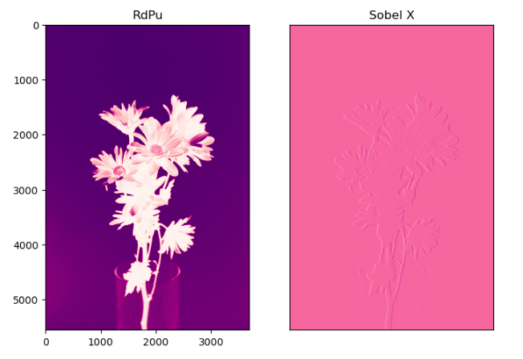
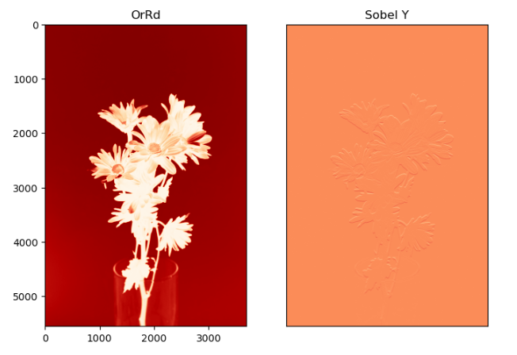
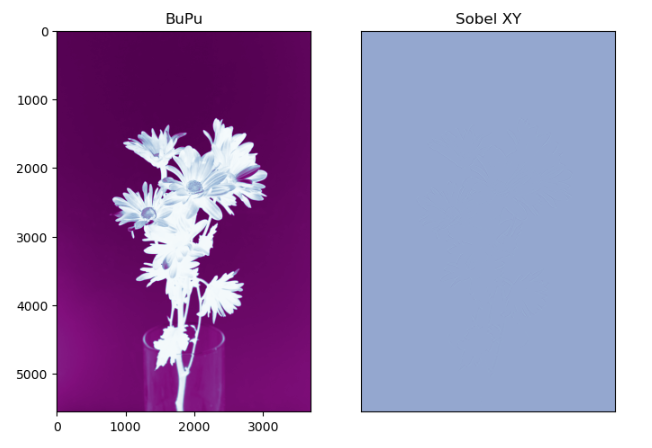
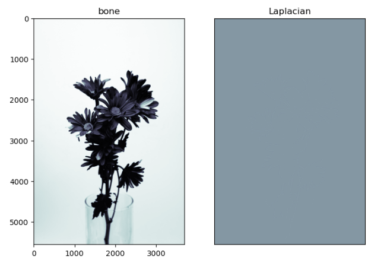

# EDGEDETECTION

## Aim:
To perform edge detection using Sobel, Laplacian, and Canny edge detectors.

## Software Required:
Anaconda - Python 3.7

## Algorithm:

### Step1:
Import the required packages for further process.
<br>

### Step2:
Read the image and convert the rgb image to gray scale image.
<br>

### Step3:
Use filters for smoothing the image to reduce the noise.
<br>

### Step4:
Apply the respective filters - Sobel, Laplacian edge detector and Canny edge detector.
<br>

### Step5:
Display the filtered image using plot and imshow.
<br>

 
## Program:

DEVELOPED BY:SNEHA BASYAL M

REGISTER NUMBER:212222240101

```PYTHON
# Import the packages

import cv2
import matplotlib.pyplot as plt

# Load the image, Convert to grayscale and remove noise

image = cv2.imread("dip2.png")
gray_image = cv2.cvtColor(image,cv2.COLOR_BGR2GRAY)
new_image = cv2.GaussianBlur(gray_image,(3,3),0)

# SOBEL EDGE DETECTOR

# SOBEL X:

sobelx = cv2.Sobel(new_image,cv2.CV_64F,1,0,ksize = 5)
plt.figure(figsize=(8,8))
plt.subplot(1,2,1)
plt.imshow(new_image,cmap = 'RdPu')
plt.title('RdPu')
plt.subplot(1,2,2)
plt.imshow(sobelx,cmap = 'RdPu')
plt.title("Sobel X")
plt.xticks([])
plt.yticks([])
plt.show()

# SOBEL Y:

sobely = cv2.Sobel(new_image,cv2.CV_64F,0,1,ksize = 5)
plt.figure(figsize = (8,8))
plt.subplot(1,2,1)
plt.imshow(new_image,cmap = 'OrRd')
plt.title('OrRd')
plt.subplot(1,2,2)
plt.imshow(sobely,cmap = 'OrRd')
plt.title("Sobel Y")
plt.xticks([])
plt.yticks([])
plt.show()

# SOBEL XY:

sobelxy = cv2.Sobel(new_image,cv2.CV_64F,1,1,ksize=5)
plt.figure(figsize = (8,8))
plt.subplot(1,2,1)
plt.imshow(new_image,cmap = 'BuPu')
plt.title('BuPu')
plt.subplot(1,2,2)
plt.imshow(sobelxy,cmap = 'BuPu')
plt.title('Sobel XY')
plt.xticks([])
plt.yticks([])
plt.show()

# LAPLACIAN EDGE DETECTOR

laplacian = cv2.Laplacian(new_image,cv2.CV_64F)
plt.figure(figsize = (8,8))
plt.subplot(1,2,1)
plt.imshow(new_image,cmap = 'bone')
plt.title('bone')
plt.subplot(1,2,2)
plt.imshow(laplacian,cmap = 'bone')
plt.title('Laplacian')
plt.xticks([])
plt.yticks([])
plt.show()

# CANNY EDGE DETECTOR

canny_edge = cv2.Canny(new_image,120,150)
plt.figure(figsize = (8,8))
plt.subplot(1,2,1)
plt.imshow(new_image,cmap = 'gist_gray')
plt.title('gist_gray')
plt.subplot(1,2,2)
plt.imshow(canny_edge,cmap = 'gist_gray')
plt.title('Canny Edges')
plt.xticks([])
plt.yticks([])
plt.show()
```
## OUTPUT:

## SOBEL EDGE DETECTOR

### SOBEL X:


<br>
<br>
<br>
<br>
<br>
<br>

### SOBEL Y:


<br>
<br>
<br>
<br>
<br>
<br>

### SOBEL XY:


<br>
<br>
<br>
<br>
<br>
<br>

### LAPLACIAN EDGE DETECTOR


<br>
<br>
<br>
<br>
<br>
<br>

### CANNY EDGE DETECTOR


<br>
<br>
<br>

## RESULT
Thus the edges are detected using Sobel, Laplacian, and Canny edge detectors.
